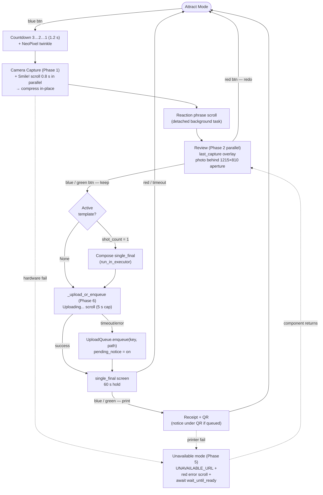
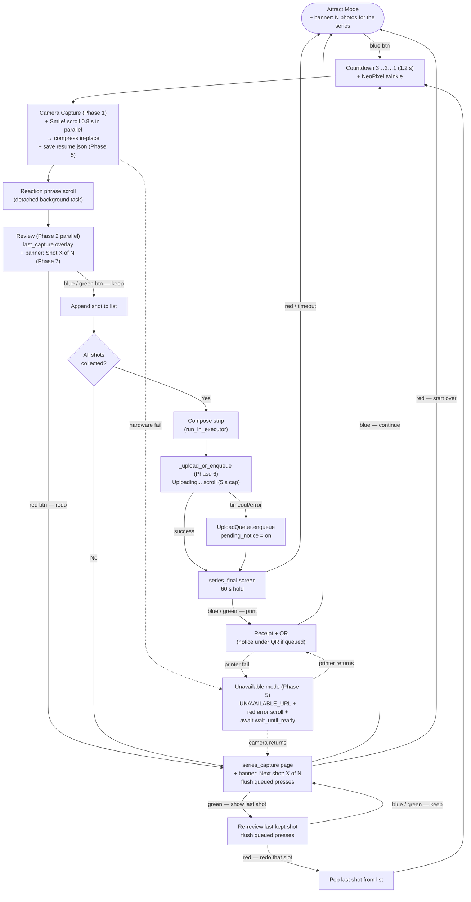

# Photobooth — Architecture Reference

Hardware target: **Raspberry Pi 4B** running Raspberry Pi OS (Buster/Bullseye).
Runtime: **Python 3.7+**, single asyncio process.

---

## Package Overview

```
photobooth/           ← installable Python package
  photobooth/
    __init__.py       ← public API; hardware deps guarded by try/except ImportError
    booth.py          ← Booth base class (web server, kiosk, CDP display helpers)
    booth_main.py     ← asyncio entry point — PhotoBooth class + main()
                         (exposed as the photobooth-run console script)
    booth_clear.py    ← shutdown helper — clears NeoPixel + LEDs
                         (exposed as photobooth-clear; ExecStopPost target)
    rpi.py            ← RPi(Booth) — GPIO interrupt → asyncio event bridge
    camera.py         ← Camera — gphoto2 wrapper, async capture, per-camera startup config
    neopixel.py       ← Neopixel — ws281x panel animations (scroll, twinkle, rainbow…)
    printer.py        ← Printer — ESC/POS receipt printer (PBM-8350U) over raw
                         USB via `python-escpos`. Prints the marketing receipt
                         with the photo's QR code.
    uploader.py       ← Uploader — S3 upload, presigned URL, randomised key paths
    strip.py          ← PhotoStrip — Pillow compositor; supports multi-column tiling
    template_loader.py← TemplateLoader ABC + LocalTemplateLoader
    resources/        ← static assets: kiosk.sh, strip_test_template PNG/JSON, fonts
    health.py         ← HealthMonitor — async probe registry + poll-based
                         readiness tracking (v0.5.0)
    state_store.py    ← atomic JSON file I/O for runtime state (v0.5.0)
    upload_queue.py   ← UploadQueue — persistent FIFO for deferred S3
                         uploads (v0.5.0)
  photobooth_web/     ← Django web app (kiosk browser target)
    mainscreen/       ← views: attract, last_capture, single_final, series_final,
                         series_capture, unavailable
```

---

## Component Map

```
PhotoBooth (booth_main.py)
│
├── RPi (rpi.py)                  ← extends Booth
│   ├── setup_gpio_events()       GPIO interrupt → call_soon_threadsafe → asyncio.Queue
│   ├── next_event()              await next GPIO event string from queue
│   ├── add_camera()              → Camera
│   ├── add_neopixel()            → Neopixel
│   └── add_printer()             → Printer          (receipt / QR)
│
├── Camera (camera.py)
│   ├── __init__(model, startup_config=None)
│   │                             applies gphoto2 --set-config for each key in
│   │                             startup_config after base capturetarget config
│   ├── capture_async()           non-blocking gphoto2 capture via asyncio subprocess
│   └── copy_last_shot_to_dir()   cp last image to BOOTH_DIR archive
│
├── Uploader (uploader.py)
│   ├── upload(path)              → public S3 URL (key: booth/yyyy/mm/dd/<token>_name)
│   ├── make_key(path)            → S3 object key (same pattern as upload)
│   └── presign(key)              → time-limited presigned URL for QR code
│
├── PhotoStrip (strip.py)
│   ├── __init__(loader, name)    load template PNG + JSON sidecar once at startup
│   ├── compose(shots, out)       center-crop shots into slots → overlay → JPEG
│   │                             (single-strip output; one template application)
│   └── expand_for_print(in, out) duplicate single strip across `columns` for the
│                                 physical print medium; pass-through when columns ≤ 1
│
└── LocalTemplateLoader (template_loader.py)
    └── load(name)                read <base>/<name>/template.{png,json}
```

---

## asyncio Architecture

The booth runs as a **single asyncio event loop** (`asyncio.run(PhotoBooth().run())`).

### GPIO → asyncio bridge

GPIO interrupts fire on a background thread (RPi.GPIO callback). Each interrupt calls
`loop.call_soon_threadsafe(queue.put_nowait, event_label)` to deliver a string event
into an `asyncio.Queue`. `await self.rpi.next_event()` drains the queue one event at a
time. GPIO bouncetime is 500 ms to suppress mechanical chatter.

### Event queue flushing

Every state transition that presents a new set of choices to the user calls
`await _flush_events()` after navigating to the new screen. This discards any button
presses queued during the previous state (countdown, animations, compositing). Flush
points: start of `_review_shot()`, start of `_series_capture_review()`, return to
`_series_capture_review()` after a re-review, and before the final-screen hold.

### Blocking I/O

| Operation | Mechanism |
|---|---|
| Pillow compositing (`PhotoStrip.compose`) | `loop.run_in_executor(None, fn, ...)` |
| Image compression (`_compress_image`) | `loop.run_in_executor(None, fn, ...)` |
| ESC/POS receipt printing (`_do_print`) | `loop.run_in_executor(None, fn, ...)` |
| gphoto2 capture (`capture_async`) | `asyncio.create_subprocess_exec` |

### Background tasks

- **Attract scroll** — runs as an `asyncio.Task`; cancelled on capture start, recreated
  when the booth returns to attract.
- **S3 upload** — sequential with a 5 s wall-clock cap (`Uploader.upload_with_timeout`).
  On success, the receipt prints with the public QR. On timeout/error, the capture is
  added to the persistent `UploadQueue` and the receipt prints with a "pending upload"
  notice + the deterministic QR URL; the URL works once `_upload_queue_worker` drains
  it. See [Offline Uploads](#offline-uploads).
- **Reaction phrase scroll** — Phase 2 launches the post-capture phrase as a
  detached `self._phrase_task` so `display_url(REVIEW_URL)` can navigate the
  kiosk to the review screen in parallel. `_review_shot` cancels + awaits
  the task before returning so the panel is idle by the next state transition.
- **`HealthMonitor.recheck_loop`** — re-probes any component currently in the
  `unavailable` state every `HEALTH_RECHECK_INTERVAL` seconds (default 10 s).
  Started at the tail of `_startup` and runs for the booth's lifetime.
  See [Health Monitoring & Recovery](#health-monitoring--recovery).
- **`_upload_queue_worker`** — drains the `UploadQueue` while `HealthMonitor`
  reports `net_www` ready. Exponential backoff from 5 s to 5 min on failure.
  Started at the tail of `_startup`; cancellable.

### Browser navigation (CDP)

`Booth.display_url(url)` navigates the kiosk Chromium instance via the Chrome DevTools
Protocol WebSocket at `localhost:9222` — no process respawn needed. Falls back to
spawning a new Chromium process if the debugging port is unavailable (first boot).
`kiosk.sh` starts Chromium with `--remote-debugging-port=9222`.

---

## Camera Startup Config

Each camera model can require specific gphoto2 settings at startup. These are defined
alongside `CAMERA_MODEL` in `booth_main.py` as a plain dict:

```python
CAMERA_MODEL = "Canon EOS 800D"
CAMERA_STARTUP_CONFIG = {
    "autoexposuremode": 3,  # Manual — prevents built-in flash from auto-firing
}
```

`Camera.__init__` applies each key via `gphoto2 --set-config key=value` after the base
`capturetarget` config. To support a different camera, update both constants; no other
code changes are required.

---

## Health Monitoring & Recovery

`photobooth/health.py` introduces `HealthMonitor`, the booth's source of
truth for "is component X usable right now?". Every hardware and
connectivity dependency is registered with an async **probe** callable
returning `bool`; the monitor invokes the probe on demand and tracks the
latest state on a `ComponentHealth` record (`name`, `state`, `last_error`,
`last_checked`).

### Probe registry

Probes are owned by the module that owns the hardware:

| Component | Probe | Module |
|---|---|---|
| `web` | `probe_web_available()` | `booth.py` |
| `neopixel` | `probe_neopixel_available(control)` | `neopixel.py` |
| `camera` | `probe_camera_available(model)` | `camera.py` |
| `printer` | `probe_printer_available(model)` | `printer.py` |
| `net_local` | `probe_local_network()` | `booth.py` |
| `net_www` | `probe_internet_available(host)` | `booth.py` |

Each probe is wrapped in try/except inside `HealthMonitor._probe_once`,
so a probe that raises is treated as `False` and the exception repr is
stored on `ComponentHealth.last_error`.

`probe_camera_available` is layered for correctness: it first runs
`gphoto2 --auto-detect` to confirm the model is on the USB bus, then
issues `gphoto2 --summary` (5 s subprocess timeout) to force a real PTP
roundtrip. The double-check is load-bearing — a Canon T7i in a half-
failed state stays USB-enumerated after power loss but cannot capture,
and a freshly powered-on body needs a few seconds before PTP responds.
Without the summary check the recheck loop would flip `camera` back to
`ready` while captures still returned phantom 0-byte files.

### Startup wait

`_startup()` calls `register(name, probe)` then
`wait_until_ready(name, *, timeout=..., interval=1.0)` for each
dependency. The monitor polls every `interval` seconds until the probe
returns ready (or `timeout` elapses) and emits a single
`Waiting for <name>` INFO line on the first failure so the systemd
journal records exactly which dependency the service is blocked on.

| Component | Constant | Default | On miss |
|---|---|---|---|
| web | `HEALTH_TIMEOUT_WEB` | 30 s | raise → systemd restart |
| neopixel | `HEALTH_TIMEOUT_NEOPIXEL` | 300 s | raise → systemd restart |
| camera | `HEALTH_TIMEOUT_CAMERA` | 300 s | raise → systemd restart |
| printer | `HEALTH_TIMEOUT_PRINTER` | 300 s | raise → systemd restart |
| net_local | `HEALTH_TIMEOUT_NET_LOCAL` | 5 s | log + continue (degraded) |
| net_www | `HEALTH_TIMEOUT_NET_WWW` | 5 s | log + continue (degraded) |

`_init_with_retry(name, factory)` covers the boundary case where the
probe passes but the constructor (e.g. `add_camera`) still raises — it
re-awaits `wait_until_ready(name, timeout=None)` and tries again.

### Recheck loop

`HealthMonitor.recheck_loop(interval=HEALTH_RECHECK_INTERVAL)` runs as a
background `asyncio.Task` launched at the tail of `_startup`. It re-
probes any component currently in the `unavailable` state every
`interval` seconds. Components in `ready` or `unknown` are not
re-probed — readiness is owned by the original caller of
`wait_until_ready`. Every state transition emits a `StateChange` record
on `HealthMonitor.state_changes` (an `asyncio.Queue`) so downstream
consumers can react to recovery events without polling.

### Unavailable mode + resume

A runtime failure of a required hardware component routes through
`PhotoBooth._enter_unavailable(component, scroll_text)`:

1. Queued GPIO events from the failure transient are drained so a
   held / double-bounced press doesn't auto-skip the recovery before
   the user can see it.
2. The kiosk navigates to `UNAVAILABLE_URL`
   (`/main/unavailable/` → `unavailable.html` → `unavailable.png`).
3. A continuous red scroll on the neopixel announces the diagnosis
   (`"Camera not detected. Check power and USB."` for camera,
   `"Printer not responding"` for printer).
4. The flow awaits `HealthMonitor.wait_until_ready(component, timeout=None)`.
5. On probe-success, the screen + scroll hold for
   `UNAVAILABLE_MIN_HOLD_SECONDS = 2.5 s` measured from step 1 — without
   the pad, a power-cycled camera that re-enumerates in <1 s would flash
   the unavailable screen by before the user could register it.
6. Scroll task cancelled, panel cleared, queued events drained again
   (so presses during the hold don't consume the first input of the
   recovered state), and control returns to the caller — which
   re-issues the failed operation.

**Stale USB handle recovery.** Power-cycling a USB device re-enumerates
it and assigns a new bus/dev address; the cached handles in `Camera`
(`self.addr`) and `Printer` (the escpos `Usb` wrapper) become dead
even though the corresponding probes report ready. The recovery
callers refresh them before retrying:

- `_take_one_shot` calls `Camera.refresh_address()` after
  `_enter_unavailable` returns — re-runs `get_cameras()` and updates
  `self.addr` so the next `gphoto2 --port` targets the live device.
- `_print_with_recovery` calls `Printer.reconnect()` (rebuilds
  `self.printer = Usb(**self._config)`) before its retry print.

Both methods are no-ops on the fast path (when no power cycle has
happened) and degrade gracefully (log + return `False`) when the
refresh itself raises.

**Internet / S3 failures never enter unavailable mode** — they are
handled entirely by the offline-upload path so the booth stays fully
operable for capture + receipt printing during connectivity outages.

`_print_with_recovery(url, pending_notice, post_recovery_url)` takes a
`post_recovery_url` so the kiosk lands on the right screen after
`_enter_unavailable` exits and before the retry print fires — the
unavailable-mode handler leaves the browser parked on `unavailable.png`,
so callers pass the screen the user was on at the moment of failure
(capture path: `final_url`; reprint path: `ATTRACT_URL`) to keep the
kiosk and LED panel in sync.

#### Resume state file

Before any capture, `_take_one_shot(resume_context=...)` persists a
record to `RESUME_STATE_PATH` (default `/var/lib/photobooth/resume.json`,
override with `BOOTH_RESUME_STATE_PATH`). The record carries:

| Field | Meaning |
|---|---|
| `mode` | `"single"` or `"series"` |
| `pending_step` | the step currently in flight (`"capture"`) |
| `series_shots` | list of paths already kept this session (series only) |
| `shot_index` | 1-based index of the shot in flight (series only) |
| `total` | total shots in the active template (series only) |
| `template_name` | active template folder name |

On clean session completion, `_clear_resume_state()` deletes the file.
On a fresh process start with a `resume.json` present, `_resume_from`
navigates the kiosk to the between-shots page with
`?mode=series&shot=X&total=N` so the operator sees where they left off;
the next blue-button event re-enters `_run_series` with
`starting_shots=series_shots` and the partial series picks up at the
failed slot.

Resume is **series-mode only** — a single-shot interruption has no
partial state worth preserving.

#### Atomic JSON I/O

`photobooth/state_store.py` is the shared file-I/O layer used by both
`resume.json` and `upload_queue.json`:

- `load_json(path)` — returns `{}` on a missing file (no raise); other
  errors (malformed JSON, permission failures) propagate so real bugs
  aren't masked.
- `save_json_atomic(path, data)` — serializes to `<path>.tmp`, `fsync`s
  the temp file, `os.replace`s it onto `path`, then `fsync`s the
  containing directory. A crash mid-write leaves the previous (good)
  file intact.
- `delete_if_exists(path)` — silent no-op on missing file.

All callers open + close per operation — there are no long-held handles
or in-memory authoritative copies.

---

## Offline Uploads

`photobooth/upload_queue.py` introduces `UploadQueue`, a JSON-backed FIFO
queue that holds captures whose S3 upload didn't complete within the 5 s
wall-clock cap. The QR code on the printed receipt still works because
`Uploader.public_url(key)` is deterministic on the key — the queued
upload eventually places the object at exactly the path the QR encoded
at print time.

### Capture-time path

The capture flow shows the composite immediately and runs
`_upload_or_enqueue` as a background task while the user views their
photo:

```python
await self.display_url_with_context(final_url, ...)          # composite shows now
upload_task = asyncio.create_task(self._upload_or_enqueue(image_path))
decision = await asyncio.wait_for(self.rpi.next_event(), timeout=60)
qr_url, pending_notice = await upload_task                   # almost always already done
```

By the time the user reacts (a few seconds of look-time), the upload
task has typically completed; the `await upload_task` before the print
branch costs nothing in the common case and at most `UPLOAD_TIMEOUT_SECONDS`
in the worst case. The QR target is deterministic (`public_url(make_key(...))`
is computed inside `_upload_or_enqueue` before any S3 traffic), so the
receipt is always correct.

`PhotoBooth._upload_or_enqueue(image_path)` itself:

1. `make_key(image_path)` builds the deterministic S3 key.
2. `public_url(key)` is stashed up front and used as the receipt QR
   target regardless of whether the upload completes.
3. **Short-circuit:** if `HealthMonitor.is_ready("net_www")` is False,
   skip the upload attempt entirely, enqueue immediately, and return
   `(qr_url, PENDING_UPLOAD_NOTICE)`. Necessary because boto3's
   blocking executor call can wedge past `asyncio.wait_for` when DNS
   itself is unreachable, which previously stranded the booth on the
   final screen with no receipt and no consumed input events.
4. A continuous "Uploading..." scroll starts on the neopixel.
5. `Uploader.upload_with_timeout(path, key, timeout_s=5.0)` runs.
6. On success: scroll cancelled, control returns with `(qr_url, None)`.
7. On `asyncio.TimeoutError` or any other `boto3` exception:
   `UploadQueue.enqueue(key, image_path)` is called; the receipt
   `pending_notice` is set to `PENDING_UPLOAD_NOTICE`
   (`"* Photo upload pending - your QR will work once the booth
   reconnects to the internet."`) which `_do_print` renders under the
   QR code. The same path also force-probes `net_www` so the recheck
   loop owns the recovery flip (instead of the queue worker hammering
   a known-bad link).

The receipt prints either way; the booth never blocks the user for more
than 5 s on a slow link.

### Queue file

| Path | Default | Override |
|---|---|---|
| Upload queue | `/var/lib/photobooth/upload_queue.json` | `BOOTH_UPLOAD_QUEUE_PATH` |
| Resume state | `/var/lib/photobooth/resume.json` | `BOOTH_RESUME_STATE_PATH` |

On-disk shape:

```json
{
  "items": [
    {
      "key": "booth/2026/06/16/aB3xK9p2_20260616-12h30m00s-000001.jpg",
      "image_path": "/opt/booth_images/20260616-12h30m00s-000001.jpg",
      "enqueued_at": 1750000000.0,
      "attempts": 2,
      "last_error": "...",
      "last_attempted_at": 1750000150.0
    }
  ]
}
```

The top-level object (rather than a bare list) leaves room for future
metadata (schema version, last-drain timestamp) without a migration.
Per-item `attempts` / `last_error` / `last_attempted_at` survive
reboots so the worker doesn't "forget" failure history after a restart.

### Drain worker

`PhotoBooth._upload_queue_worker()` is started in `_startup` as a
background `asyncio.Task` that runs for the booth's lifetime. The loop:

1. `peek()` the queue head. Empty? Sleep `UPLOAD_WORKER_BACKOFF_INITIAL`
   (5 s) and reset backoff.
2. Check `HealthMonitor.is_ready("net_www")`. If not ready, sleep and
   double the backoff, capped at `UPLOAD_WORKER_BACKOFF_CAP` (300 s).
3. Call `Uploader.upload(item.image_path, key=item.key)`. On success,
   `pop(key)`, reset backoff. On failure, `mark_attempt(key, err)`,
   force a `net_www` re-probe (so `recheck_loop` is the one to flip it
   back to `ready` when the link recovers), sleep, double the backoff.

The deterministic-key invariant matters: the worker reuses the
`item.key` that was stashed at enqueue time, so the receipt QR printed
during the outage and the object eventually uploaded after recovery
share the same URL — no QR rewrites, no "your link will be different"
explanations.

### Provisioning prerequisite

`/var/lib/photobooth/` must exist and be writable by the `pi` user.
`rpi_provisioning/booth_boot/init_setup.sh` creates it at provision
time; existing booths upgrading to v0.5.0 need
`sudo install -d -o pi -g pi /var/lib/photobooth` once before the first
restart.

---

## Printer

The booth drives a single printer: a PBM-8350U thermal receipt printer.
After each capture it prints a marketing receipt carrying the photo's QR
code (a presigned, or queued-deterministic, S3 URL) so the customer can
download their shot.

| Class | Module | Device | Protocol | Backend |
|---|---|---|---|---|
| `Printer` | `printer.py` | PBM-8350U thermal receipt printer | ESC/POS over raw USB endpoint | `python-escpos` → `escpos.printer.Usb` |

`Printer.__init__(name, model, **kwargs)` resolves `model` against
`PRINTER_MAP` (keyed by model string, falling back to `"default"`) to get
the `escpos.printer.Usb` vendor/product config, then opens the device. Its
method surface (`text`, `ln`, `cut`, `qr`, `barcode`) is a thin wrapper
over the escpos `Usb` object. The booth registers it via
`Booth.add_printer(name="receipt", model="PBM-8350U")`.

### Receipt printing in the flow

`PhotoBooth._do_print(url, pending_notice=None)` is the synchronous
receipt routine; it runs in the thread executor (it is the only blocking
ESC/POS path). It writes the marketing copy, emits the QR via
`self.printer.qr(content=url, size=5)`, optionally prints the
`pending_notice` line (set when the upload was queued rather than
completed — see [Offline Uploads](#offline-uploads)), and cuts the paper.

`_print_with_recovery(url, pending_notice, post_recovery_url)` wraps
`_do_print` in the thread executor and, on failure, routes through
unavailable mode (red "Printer not responding" scroll +
`wait_until_ready("printer")`), calls `Printer.reconnect()` to rebuild the
escpos `Usb` handle after a possible power cycle, re-navigates the kiosk to
`post_recovery_url`, and retries the print. It is the canonical logger for
printer failures, so `_do_print` re-raises silently rather than
double-logging.

### Planned: photo printer separation

A future revision adds a second, protocol-distinct printer — a Canon
Selphy CP1500 dye-sub for 4×6 prints (CUPS via `lp`), alongside renaming
`Printer` → `ThermalPrinter` to make the ESC/POS coupling explicit once a
generic-looking name would mislead. `PhotoStrip.expand_for_print()`
already exists for the column-tiled 4×6 sheet that workstream needs, but
nothing calls it in the runtime today. The full design (two-class
rationale, CUPS-via-`lp`, CP1500 driver/Gutenprint risk on Buster) lives
in `BACKLOG.md` → "Canon Selphy CP1500 photo printer integration".

---

## Template System

### Screen overlays (`photobooth_web/mainscreen/static/img/`)

Full-screen PNG images displayed as overlays in the kiosk browser. Each HTML template
layers a `last.jpg` photo beneath the PNG using `position: absolute` / `object-fit:
contain`. The frame stays `visibility: hidden` until both images have loaded, preventing
a bare-photo flash. `Date.now()` cache-busting on `last.jpg` ensures each navigation
shows the latest capture.

| File | Screen |
|---|---|
| `attract_static.png` | Attract / idle |
| `last_capture.png` | Per-shot review overlay (1215×810 transparent aperture for the photo) |
| `series_capture.png` | Between-shots instruction page (series mode) |
| `series_final.png` | Composited strip displayed before upload |
| `single_final.png` | Final single-shot overlay before upload |
| `unavailable.png` | Hardware-unavailable screen (Phase 5) |
| `nolast.jpg` | Fallback placeholder when no shot exists |

### Compositor templates (`/opt/photobooth/templates/`)

RGBA PNG + JSON sidecar pairs consumed by `PhotoStrip.compose()`. Stored outside the
repo so templates can be swapped without a code deploy.

```
/opt/photobooth/templates/
  strip_test_template/
    template.png    ← RGBA PNG; transparent slots reveal photos beneath
    template.json   ← sidecar — canvas, shot count, slot coordinates, columns
  strip_classic/
    template.png
    template.json
  …
```

### Sidecar JSON schema

```json
{
  "name": "Human-readable name",
  "shot_count": 3,
  "columns": 2,
  "canvas": { "width": 600, "height": 1800 },
  "slots": [
    { "x": 31, "y":  91, "width": 538, "height": 358 },
    { "x": 31, "y": 511, "width": 538, "height": 358 },
    { "x": 31, "y": 931, "width": 538, "height": 358 }
  ]
}
```

`shot_count` must equal `len(slots)`. `columns` defaults to 1 and is read only by
`expand_for_print()` (see below) — `compose()` ignores it.

### Compositor — split between digital and print

`PhotoStrip` provides two methods so the digital and print pipelines emit
different artifacts from the same template:

#### `compose(shots, output_path)` — single strip (digital path)

1. Create a blank RGB canvas at canvas size.
2. For each slot: open the corresponding shot, `_center_crop` it to slot dimensions
   (scale-to-fill + center-crop — no letterboxing), paste at `(slot["x"], slot["y"])`.
3. Alpha-composite the RGBA template on top.
4. Save as JPEG (quality 95) and return the path.

Output is always one strip wide (canvas size). This is what gets uploaded to S3
and displayed on the kiosk review screen — what the customer actually downloads.

Template PNG is loaded once in `__init__` and reused across all `compose()` calls.

#### `expand_for_print(input_path, output_path)` — column-tiled (print path)

If `columns > 1`, duplicate the composed strip horizontally `columns` times onto
a wider canvas (e.g. 600×1800 single strip → 1200×1800 print-ready output for
columns=2 on 4×6 print medium). The operator cuts the duplicates apart after
printing.

If `columns <= 1`, no duplication is needed and the method is a pass-through:
`input_path` is returned unchanged and no file is written. Callers can use the
returned path unconditionally without branching on column count.

`expand_for_print` is implemented and tested but not yet wired into the
runtime — `booth_main.py` does not call it today. It exists for the planned
photo-printer path (a column-tiled 4×6 sheet for the Canon Selphy CP1500;
see `BACKLOG.md`). The single-strip output from `compose()` is the source
of truth for the S3 upload and the kiosk review screen.

### Mode selection (`booth_main.py` constants)

| `ACTIVE_TEMPLATE` | `shot_count` | Mode |
|---|---|---|
| `None` | — | Single shot, plain photo uploaded |
| `"single_4x6"` | 1 | Single shot + final overlay composite |
| `"strip_test_template"` | > 1 | Series / photo-strip mode |

---

## Capture Flow

### Button roles by context

| Context | GPIO 23 green | GPIO 24 red | GPIO 25 blue |
|---|---|---|---|
| Attract / idle | Reprint last receipt | — | Start capture |
| Review (`last_capture`) | **Keep** → proceed | **Redo** → series_capture / attract | **Keep** → same as green |
| `series_capture` between-shots | **Show Last Shot** | **Start Over** → attract | **Continue** → next shot |
| Re-review from `series_capture` | **Keep** → series_capture | **Redo** → retake that slot | **Keep** → same as green |
| Final screen (60 s hold) | **Print receipt** | — → attract | **Print receipt** |

Blue and green are interchangeable wherever green means "keep" or "print". Red is always
the cancel / redo / start-over action. Constants `KEEP_BUTTON` and `REDO_BUTTON` in
`booth_main.py` map logical roles to GPIO labels so wiring can be remapped without
touching flow logic.

### Image compression

After every capture, `_compress_image` runs in the thread executor: the image is resized
to a maximum dimension of 2048 px on the longest side and recompressed at JPEG quality
85 (via Pillow `thumbnail` + `save(optimize=True)`). Typical output: ~300 KB vs 6–7 MB
raw. Compression runs before the review screen is shown.

### Single mode



### Series mode



### Banner overlay (series mode)

The "Shot X of N" / "Next shot: X of N" / "N photos will be taken for
the series" overlays are pure-CSS bands rendered on top of
`attract_static.png`, `last_capture.png`, and `series_capture.png`.
Banner context is passed from `booth_main` to the Django views as URL
query parameters — there is no shared in-memory state between the
runtime and the kiosk browser.

```
PhotoBooth.display_url_with_context(URL, **_series_params(shot=X))
    → http://.../main/<screen>/?mode=series&total=N&shot=X
        → views.<screen>(request)
            → _series_context(request) coerces mode/total/shot
                → template: <div class="series-banner">…
```

`_series_params(shot=...)` lives on `PhotoBooth`; it reads
`self.strip.shot_count` to decide `mode` and `total`. `display_url`
calls without context default to `mode=single`. `_review_shot` forces
`mode=single` on the in-series re-review path so the banner stays
hidden when the user is re-inspecting a kept shot.

CSS variables on `:root` in `static/css/series-banner.css` control the
banner's max area (`y∈[945,1075]`, `x∈[250,1675]`), vertical padding
(MIN 10 px, do not lower), font size, colour, and shadow. Future
tuning is a single-file edit; no template changes needed.

---

## Button Wiring (GPIO)

| Button | GPIO | Pin | Event label |
|---|---|---|---|
| Shutter (blue) | 25 | 22 | `"capture"` |
| Green | 23 | 16 | `"green"` |
| Red | 24 | 18 | `"red"` |

Bouncetime: 500 ms. GPIO events fire on `FALLING` edge and are delivered to the asyncio
queue via `call_soon_threadsafe`.

### Electrical expectations

The code assumes **active-low** button wiring: the GPIO line idles HIGH (pulled to 3.3V
via an external resistor) and is shorted to GND when the button is pressed. A press
produces a HIGH → LOW transition — the falling edge `add_event_detect` is registered
for. `setup_gpio_events` does **not** enable the internal pull resistor (`pull_up_down`
is not passed), so an external pull-up is mandatory; without one the line floats and
the input state is undefined.

Wiring topology, parts list, and cat5e pair assignment live in
`rpi_provisioning/HARDWARE.md`. A defective idle-LOW wiring still in service on some
booths (red and green buttons as of 2026-05-25) produces phantom triggers under EMI;
see `BACKLOG.md` → "Spurious capture — EMI on GPIO signal line" for the diagnosis and
migration plan.

---

## Extending the Template Loader

`TemplateLoader` is an abstract base class. Implement `load(template_name) -> dict`
returning `{"template_path": str, "config": dict}`. `LocalTemplateLoader` is the
reference implementation. Possible alternatives:

- `USBTemplateLoader` — scan mounted USB drives for template folders
- `RemoteTemplateLoader` — fetch template assets from a URL

Pass the loader instance to `PhotoStrip(loader=..., template_name=...)`.

---

## Running Tests

### photobooth package

```bash
cd photobooth
python3 -m pytest                  # full suite
python3 -m pytest tests/test_<x>   # one file
```

No Pi hardware required at test time; hardware deps (`RPi.GPIO`,
`neopixel`, `board`) are guarded by `try/except ImportError` in
`__init__.py`. The few tests that need `board` stub it via `sys.modules`
before importing `booth_main`.

| Test file | Covers |
|---|---|
| `test_strip.py` | `PhotoStrip` init / compose / center-crop; real template + sidecar integration; `expand_for_print` duplication and pass-through; `LocalTemplateLoader` happy / missing path / malformed JSON. |
| `test_uploader.py` | `make_key` token uniqueness (reprint-bug regression), key format, `public_url` shape, `upload()` returns plain URL not presigned, error path re-raises. |
| `test_logging_no_credentials.py` | Scans every log record (message + args) for `AKIA` / `X-Amz-Signature` / `Signature=` / etc. across upload + presign paths. Hard-blocks credential-leak regressions. |
| `test_logging_config.py` | `setup_logging` idempotency, `BOOTH_LOG_LEVEL` handling (case-insensitive, bad-value fallback), unwritable log-file fallback. |
| `test_booth_main_env.py` | Defaults + overrides for all 6 `BOOTH_*` constants. |
| `test_env_example_consistency.py` | Cross-repo: every `BOOTH_*` key in `rpi_provisioning/booth_boot/resources/booth.env.example` is consumed by `booth_main` / `logging_config`, and vice versa. Catches doc-vs-code drift. |
| `test_camera.py` | `run_local_cmd` (error path → `logger.error`), `_build_filename`, `check_gphoto2`, `check_dir_rw_or_make`, `_read_exif_datetime` (never-raises guarantee). |
| `test_printer.py` | `PRINTER_MAP` resolution (default + PBM-8350U), escpos passthroughs, `ln()` edge cases. `python-escpos`-gated. |
| `test_series_flow.py` | `PhotoBooth._series_capture_review` — all six scenarios (continue, start_over, undo-redo, undo-keep, re-affirm-keep, re-affirm-redo). Pins the buffer-after-re-review contract. |
| `test_neopixel_scroll_duration.py` *(v0.5.0)* | `Neopixel.scroll_for_duration` derives per-frame speed so total wall-clock matches the requested duration within tolerance. |
| `test_capture_timing.py` *(v0.5.0)* | End-to-end timing of `_take_one_shot`: button press → `capture_async` dispatch ≤ 2.0 s ±5%. |
| `test_parallel_display.py` *(v0.5.0)* | `display_url(REVIEW_URL)` is scheduled before the post-capture reaction phrase task awaits its first sleep — the kiosk navigates while the phrase is still scrolling. |
| `test_health_monitor.py` *(v0.5.0)* | `HealthMonitor.register` / `wait_until_ready` / `recheck_loop` / `state_changes` transitions; probe-raise treated as `False`; timeout returns `False` without raising. |
| `test_startup_dependency_wait.py` *(v0.5.0)* | `_startup` waits for camera probe to succeed before construction; does not raise on initial unavailability; required vs optional component handling. |
| `test_state_store.py` *(v0.5.0)* | `load_json` returns `{}` on missing file; `save_json_atomic` survives a simulated mid-write crash (`os.replace` patched to raise) without corrupting the original file. |
| `test_unavailable_mode.py` *(v0.5.0)* | Camera-raise drives `display_url(UNAVAILABLE_URL)`, red scroll, and `wait_until_ready("camera")`; on ready, resumes at the failed step. |
| `test_resume_mid_series.py` *(v0.5.0)* | 3-shot series with shot 3 failing: resume reloads `series_shots` of length 2 and navigates to `series_capture?shot=3&total=3`. |
| `test_upload_queue.py` *(v0.5.0)* | `enqueue` / `peek` / `pop` / `list` / `mark_attempt` round-trip; atomic write survives simulated mid-write crash. |
| `test_upload_offline_flow.py` *(v0.5.0)* | `upload_with_timeout` raising `TimeoutError` enqueues the capture; QR URL is `public_url(key)`; `pending_notice` reaches `_do_print`. |
| `test_upload_queue_worker.py` *(v0.5.0)* | Worker drains the queue while `net_www` is ready; popping leaves queue file empty; failed upload flips `net_www` to `unavailable` and backs off. |
| `test_display_url_with_context.py` *(v0.5.0)* | Series flow drives `display_url` with the correct `?mode=series&total=N&shot=X` for each state transition. |
| `test_series_overlay_views.py` *(v0.5.0)* | Django views render the banner div only when `mode=series` is in the query string; text matches expected per-screen template. |
| `mainscreen/tests.py` *(v0.5.0)* | Last-capture template emits the new `width:1215px; height:810px; object-fit:cover` aperture geometry. |

Hardware-tied "tests" (`tests/blink_thread.py`, `cntdwn_np_test.py`, etc.) are
manual scripts run on the live booth; pytest ignores them via `addopts =
"--ignore=tests/cntdwn_np_test.py"`.

`tests/test_uploader.py` and `tests/test_logging_no_credentials.py` use
`pytest.importorskip("utilities")` — install ctp-utilities editably to run
locally: `pip3 install --user -e ../utilities`.

### Django web app (views / URLs)

```bash
cd photobooth/photobooth_web
python3 manage.py test mainscreen
```

Tests in `mainscreen/tests.py` cover: HTTP 200, correct template rendered, expected
static image filename present. No database or Pi hardware required.
