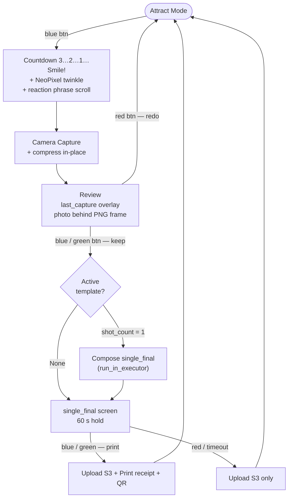
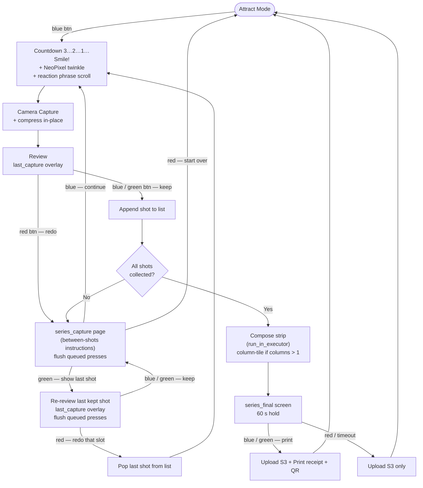

# Photobooth — Architecture Reference

Hardware target: **Raspberry Pi 4B** running Raspberry Pi OS (Buster/Bullseye).
Runtime: **Python 3.7+**, single asyncio process.

---

## Package Overview

```
photobooth/           ← installable Python package
  photobooth/
    __init__.py       ← public API; hardware deps guarded by try/except ImportError
    booth.py          ← Booth base class (web server, kiosk, CDP display helpers)
    booth_main.py     ← asyncio entry point — PhotoBooth class + main()
                         (exposed as the photobooth-run console script)
    booth_clear.py    ← shutdown helper — clears NeoPixel + LEDs
                         (exposed as photobooth-clear; ExecStopPost target)
    rpi.py            ← RPi(Booth) — GPIO interrupt → asyncio event bridge
    camera.py         ← Camera — gphoto2 wrapper, async capture, per-camera startup config
    neopixel.py       ← Neopixel — ws281x panel animations (scroll, twinkle, rainbow…)
    printer.py        ← Printer — ESC/POS receipt printer (PBM-8350U)
    uploader.py       ← Uploader — S3 upload, presigned URL, randomised key paths
    strip.py          ← PhotoStrip — Pillow compositor; supports multi-column tiling
    template_loader.py← TemplateLoader ABC + LocalTemplateLoader
    resources/        ← static assets: kiosk.sh, strip_test_template PNG/JSON, fonts
  photobooth_web/     ← Django web app (kiosk browser target)
    mainscreen/       ← views: attract, last_capture, single_final, series_final,
                         series_capture
```

---

## Component Map

```
PhotoBooth (booth_main.py)
│
├── RPi (rpi.py)                  ← extends Booth
│   ├── setup_gpio_events()       GPIO interrupt → call_soon_threadsafe → asyncio.Queue
│   ├── next_event()              await next GPIO event string from queue
│   ├── add_camera()              → Camera
│   ├── add_neopixel()            → Neopixel
│   └── add_printer()             → Printer
│
├── Camera (camera.py)
│   ├── __init__(model, startup_config=None)
│   │                             applies gphoto2 --set-config for each key in
│   │                             startup_config after base capturetarget config
│   ├── capture_async()           non-blocking gphoto2 capture via asyncio subprocess
│   └── copy_last_shot_to_dir()   cp last image to BOOTH_DIR archive
│
├── Uploader (uploader.py)
│   ├── upload(path)              → public S3 URL (key: booth/yyyy/mm/dd/<token>_name)
│   ├── make_key(path)            → S3 object key (same pattern as upload)
│   └── presign(key)              → time-limited presigned URL for QR code
│
├── PhotoStrip (strip.py)
│   ├── __init__(loader, name)    load template PNG + JSON sidecar once at startup
│   ├── compose(shots, out)       center-crop shots into slots → overlay → JPEG
│   │                             (single-strip output; one template application)
│   └── expand_for_print(in, out) duplicate single strip across `columns` for the
│                                 physical print medium; pass-through when columns ≤ 1
│
└── LocalTemplateLoader (template_loader.py)
    └── load(name)                read <base>/<name>/template.{png,json}
```

---

## asyncio Architecture

The booth runs as a **single asyncio event loop** (`asyncio.run(PhotoBooth().run())`).

### GPIO → asyncio bridge

GPIO interrupts fire on a background thread (RPi.GPIO callback). Each interrupt calls
`loop.call_soon_threadsafe(queue.put_nowait, event_label)` to deliver a string event
into an `asyncio.Queue`. `await self.rpi.next_event()` drains the queue one event at a
time. GPIO bouncetime is 500 ms to suppress mechanical chatter.

### Event queue flushing

Every state transition that presents a new set of choices to the user calls
`await _flush_events()` after navigating to the new screen. This discards any button
presses queued during the previous state (countdown, animations, compositing). Flush
points: start of `_review_shot()`, start of `_series_capture_review()`, return to
`_series_capture_review()` after a re-review, and before the final-screen hold.

### Blocking I/O

| Operation | Mechanism |
|---|---|
| Pillow compositing (`PhotoStrip.compose`) | `loop.run_in_executor(None, fn, ...)` |
| Image compression (`_compress_image`) | `loop.run_in_executor(None, fn, ...)` |
| ESC/POS receipt printing (`_do_print`) | `loop.run_in_executor(None, fn, ...)` |
| gphoto2 capture (`capture_async`) | `asyncio.create_subprocess_exec` |

### Background tasks

- **Attract scroll** — runs as an `asyncio.Task`; cancelled on capture start, recreated
  when the booth returns to attract.
- **S3 upload** — runs as an `asyncio.Task` started immediately after the final screen
  is shown, so the user sees the result while the upload completes in parallel.

### Browser navigation (CDP)

`Booth.display_url(url)` navigates the kiosk Chromium instance via the Chrome DevTools
Protocol WebSocket at `localhost:9222` — no process respawn needed. Falls back to
spawning a new Chromium process if the debugging port is unavailable (first boot).
`kiosk.sh` starts Chromium with `--remote-debugging-port=9222`.

---

## Camera Startup Config

Each camera model can require specific gphoto2 settings at startup. These are defined
alongside `CAMERA_MODEL` in `booth_main.py` as a plain dict:

```python
CAMERA_MODEL = "Canon EOS 800D"
CAMERA_STARTUP_CONFIG = {
    "autoexposuremode": 3,  # Manual — prevents built-in flash from auto-firing
}
```

`Camera.__init__` applies each key via `gphoto2 --set-config key=value` after the base
`capturetarget` config. To support a different camera, update both constants; no other
code changes are required.

---

## Template System

### Screen overlays (`photobooth_web/mainscreen/static/img/`)

Full-screen PNG images displayed as overlays in the kiosk browser. Each HTML template
layers a `last.jpg` photo beneath the PNG using `position: absolute` / `object-fit:
contain`. The frame stays `visibility: hidden` until both images have loaded, preventing
a bare-photo flash. `Date.now()` cache-busting on `last.jpg` ensures each navigation
shows the latest capture.

| File | Screen |
|---|---|
| `attract_static.png` | Attract / idle |
| `last_capture.png` | Per-shot review overlay |
| `series_capture.png` | Between-shots instruction page (series mode) |
| `series_final.png` | Composited strip displayed before upload |
| `single_final.png` | Final single-shot overlay before upload |
| `nolast.jpg` | Fallback placeholder when no shot exists |

### Compositor templates (`/opt/photobooth/templates/`)

RGBA PNG + JSON sidecar pairs consumed by `PhotoStrip.compose()`. Stored outside the
repo so templates can be swapped without a code deploy.

```
/opt/photobooth/templates/
  strip_test_template/
    template.png    ← RGBA PNG; transparent slots reveal photos beneath
    template.json   ← sidecar — canvas, shot count, slot coordinates, columns
  strip_classic/
    template.png
    template.json
  …
```

### Sidecar JSON schema

```json
{
  "name": "Human-readable name",
  "shot_count": 3,
  "columns": 2,
  "canvas": { "width": 600, "height": 1800 },
  "slots": [
    { "x": 31, "y":  91, "width": 538, "height": 358 },
    { "x": 31, "y": 511, "width": 538, "height": 358 },
    { "x": 31, "y": 931, "width": 538, "height": 358 }
  ]
}
```

`shot_count` must equal `len(slots)`. `columns` defaults to 1 and is read only by
`expand_for_print()` (see below) — `compose()` ignores it.

### Compositor — split between digital and print

`PhotoStrip` provides two methods so the digital and print pipelines emit
different artifacts from the same template:

#### `compose(shots, output_path)` — single strip (digital path)

1. Create a blank RGB canvas at canvas size.
2. For each slot: open the corresponding shot, `_center_crop` it to slot dimensions
   (scale-to-fill + center-crop — no letterboxing), paste at `(slot["x"], slot["y"])`.
3. Alpha-composite the RGBA template on top.
4. Save as JPEG (quality 95) and return the path.

Output is always one strip wide (canvas size). This is what gets uploaded to S3
and displayed on the kiosk review screen — what the customer actually downloads.

Template PNG is loaded once in `__init__` and reused across all `compose()` calls.

#### `expand_for_print(input_path, output_path)` — column-tiled (print path)

If `columns > 1`, duplicate the composed strip horizontally `columns` times onto
a wider canvas (e.g. 600×1800 single strip → 1200×1800 print-ready output for
columns=2 on 4×6 print medium). The operator cuts the duplicates apart after
printing.

If `columns <= 1`, no duplication is needed and the method is a pass-through:
`input_path` is returned unchanged and no file is written. Callers can use the
returned path unconditionally without branching on column count.

Not currently invoked from `booth_main.py` — the receipt printer only prints a
thermal QR receipt today. When a 4×6 photo-printer integration is added, the
print path will call `expand_for_print()` before sending bytes to the printer.

### Mode selection (`booth_main.py` constants)

| `ACTIVE_TEMPLATE` | `shot_count` | Mode |
|---|---|---|
| `None` | — | Single shot, plain photo uploaded |
| `"single_4x6"` | 1 | Single shot + final overlay composite |
| `"strip_test_template"` | > 1 | Series / photo-strip mode |

---

## Capture Flow

### Button roles by context

| Context | GPIO 23 green | GPIO 24 red | GPIO 25 blue |
|---|---|---|---|
| Attract / idle | Reprint last receipt | — | Start capture |
| Review (`last_capture`) | **Keep** → proceed | **Redo** → series_capture / attract | **Keep** → same as green |
| `series_capture` between-shots | **Show Last Shot** | **Start Over** → attract | **Continue** → next shot |
| Re-review from `series_capture` | **Keep** → series_capture | **Redo** → retake that slot | **Keep** → same as green |
| Final screen (60 s hold) | **Print receipt** | — → attract | **Print receipt** |

Blue and green are interchangeable wherever green means "keep" or "print". Red is always
the cancel / redo / start-over action. Constants `KEEP_BUTTON` and `REDO_BUTTON` in
`booth_main.py` map logical roles to GPIO labels so wiring can be remapped without
touching flow logic.

### Image compression

After every capture, `_compress_image` runs in the thread executor: the image is resized
to a maximum dimension of 2048 px on the longest side and recompressed at JPEG quality
85 (via Pillow `thumbnail` + `save(optimize=True)`). Typical output: ~300 KB vs 6–7 MB
raw. Compression runs before the review screen is shown.

### Single mode



### Series mode



---

## Button Wiring (GPIO)

| Button | GPIO | Pin | Event label |
|---|---|---|---|
| Shutter (blue) | 25 | 22 | `"capture"` |
| Green | 23 | 16 | `"green"` |
| Red | 24 | 18 | `"red"` |

Bouncetime: 500 ms. GPIO events fire on `FALLING` edge and are delivered to the asyncio
queue via `call_soon_threadsafe`.

### Electrical expectations

The code assumes **active-low** button wiring: the GPIO line idles HIGH (pulled to 3.3V
via an external resistor) and is shorted to GND when the button is pressed. A press
produces a HIGH → LOW transition — the falling edge `add_event_detect` is registered
for. `setup_gpio_events` does **not** enable the internal pull resistor (`pull_up_down`
is not passed), so an external pull-up is mandatory; without one the line floats and
the input state is undefined.

Wiring topology, parts list, and cat5e pair assignment live in
`rpi_provisioning/HARDWARE.md`. A defective idle-LOW wiring still in service on some
booths (red and green buttons as of 2026-05-25) produces phantom triggers under EMI;
see `BACKLOG.md` → "Spurious capture — EMI on GPIO signal line" for the diagnosis and
migration plan.

---

## Extending the Template Loader

`TemplateLoader` is an abstract base class. Implement `load(template_name) -> dict`
returning `{"template_path": str, "config": dict}`. `LocalTemplateLoader` is the
reference implementation. Possible alternatives:

- `USBTemplateLoader` — scan mounted USB drives for template folders
- `RemoteTemplateLoader` — fetch template assets from a URL

Pass the loader instance to `PhotoStrip(loader=..., template_name=...)`.

---

## Running Tests

### photobooth package

```bash
cd photobooth
python3 -m pytest                  # full suite
python3 -m pytest tests/test_<x>   # one file
```

96 tests across 9 files as of v0.4.1. No Pi hardware required at test time;
hardware deps (`RPi.GPIO`, `neopixel`, `board`) are guarded by `try/except
ImportError` in `__init__.py`. The few tests that need `board` (`test_booth_main_env`,
`test_series_flow`) stub it via `sys.modules` before importing `booth_main`.

| Test file | Covers |
|---|---|
| `test_strip.py` | `PhotoStrip` init / compose / center-crop; real template + sidecar integration; `expand_for_print` duplication and pass-through. |
| `test_template_loader.py` (in `test_strip.py`) | `LocalTemplateLoader` happy / missing path / malformed JSON. |
| `test_uploader.py` | `make_key` token uniqueness (reprint-bug regression), key format, `public_url` shape, `upload()` returns plain URL not presigned, error path re-raises. |
| `test_logging_no_credentials.py` | Scans every log record (message + args) for `AKIA` / `X-Amz-Signature` / `Signature=` / etc. across upload + presign paths. Hard-blocks credential-leak regressions. |
| `test_logging_config.py` | `setup_logging` idempotency, `BOOTH_LOG_LEVEL` handling (case-insensitive, bad-value fallback), unwritable log-file fallback. |
| `test_booth_main_env.py` | Defaults + overrides for all 6 `BOOTH_*` constants. |
| `test_env_example_consistency.py` | Cross-repo: every `BOOTH_*` key in `rpi_provisioning/booth_boot/resources/booth.env.example` is consumed by `booth_main` / `logging_config`, and vice versa. Catches doc-vs-code drift. |
| `test_camera.py` | `run_local_cmd` (error path → `logger.error`), `_build_filename`, `check_gphoto2`, `check_dir_rw_or_make`, `_read_exif_datetime` (never-raises guarantee). |
| `test_printer.py` | `PRINTER_MAP` resolution (default + PBM-8350U), escpos passthroughs, `ln()` edge cases. `python-escpos`-gated. |
| `test_series_flow.py` | `PhotoBooth._series_capture_review` — all six scenarios (continue, start_over, undo-redo, undo-keep, re-affirm-keep, re-affirm-redo). Pins the buffer-after-re-review contract. |

Hardware-tied "tests" (`tests/blink_thread.py`, `cntdwn_np_test.py`, etc.) are
manual scripts run on the live booth; pytest ignores them via `addopts =
"--ignore=tests/cntdwn_np_test.py"`.

`tests/test_uploader.py` and `tests/test_logging_no_credentials.py` use
`pytest.importorskip("utilities")` — install ctp-utilities editably to run
locally: `pip3 install --user -e ../utilities`.

### Django web app (views / URLs)

```bash
cd photobooth/photobooth_web
python3 manage.py test mainscreen
```

Tests in `mainscreen/tests.py` cover: HTTP 200, correct template rendered, expected
static image filename present. No database or Pi hardware required.
