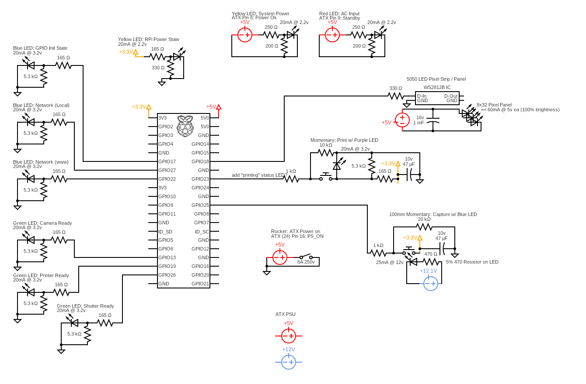

# Photobooth
This package contains a simple photobooth framework written in Python3.7.

Currently supports a RaspberryPi 4B controlling somenumber of NeoPixel (ws281x) panels/strips, Printers, and status LEDs and switches connected to the GPIO.



# Quickstart
```shell
sudo pip3 install -e git+https://github.com/namachieli/rpi_photobooth.git#egg=photobooth
sudo python3
```
```python
import photobooth, board
booth = photobooth.RPi()
np = booth.add_neopixel(name="np", rows=8, cols=32, control=board.D18)
np.panel_test()
```

# Basic structure
```
photobooth.booth.Booth()
  ˫-- photobooth.rpi.RPi( Booth() )
  |   ˫-- RPi().printers( [ Neopixel() ] )
  |   ˫-- RPi().neopixels( [ Pinter() ] )
  ˫-- photobooth.rpi.Neopixel()
  ˫-- photobooth.rpi.Printer()
```
`Booth()` - Contains all logic that is not controller (raspberrypi) specific, and loads portable components (neopixel, printer, etc) on demand.
`RPi()` - Contains all logic for the RaspberryPi Controller family.
`Arduino()` - (FUTURE)
`Neopixel()` - Contains generic logic spcific to just a ws281x compliant Neopixel component. (Portable)
`Printer()` - Contains generic logic spcific to printers (Thermal, Photo, InkJet, etc). (Portable)

New components, such as Printers, NeoPixel boards/strips, etc can easily be added as a portable class defining how to use the component, and relevant logic in Booth() to init and add them.

Because controller logic (RPi()) doesn't care about components, and inherits 'Booth' level logic, new controllers can be easily added as needed.
