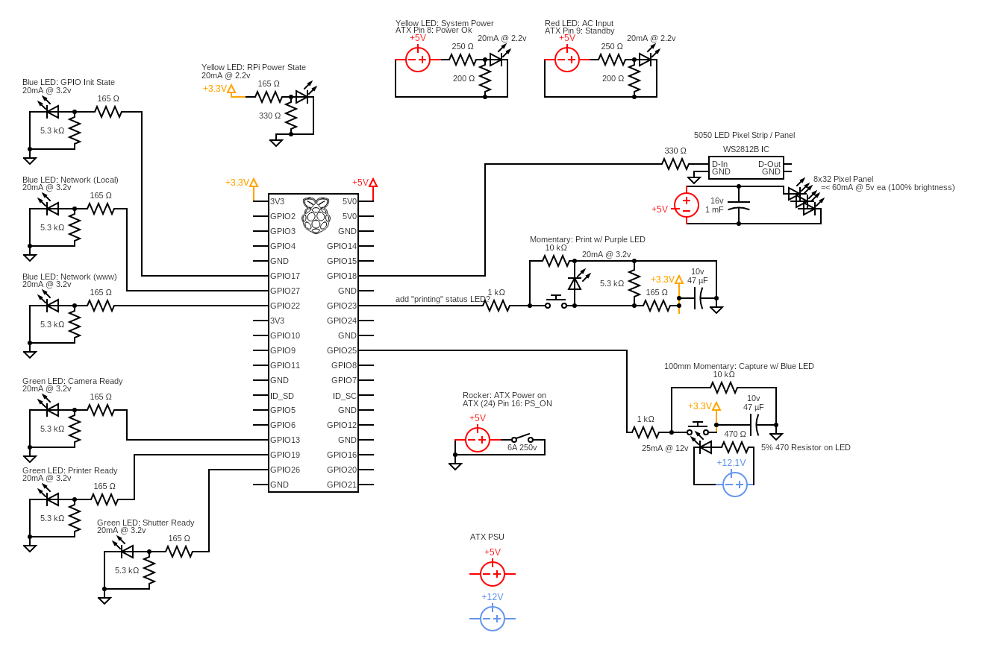

# Photobooth

Raspberry Pi 4B photobooth framework for Capturing Time Photography. Supports
single-shot and multi-shot strip modes with per-shot review, S3 upload, ESC/POS
receipt printing, and (planned) Canon Selphy CP1500 4×6 dye-sub photo printing
via CUPS. See ARCHITECTURE.md → "Printers" and BACKLOG.md for the photo-printer
workstream.

## What's new in v0.5.0

- **Faster countdown.** Blue button → shutter is now a flat ~2.0 s
  (`3.../2.../1...` at 0.4 s each + `Smile!` overlapping the capture).
- **Photo on screen sooner.** The kiosk navigates to the review screen
  in parallel with the LED reaction phrase, so the photo appears almost
  immediately after the shutter.
- **Larger review-screen aperture.** Photos render into the redrawn
  1215×810 aperture in `last_capture.png` / `single_final.png` with no
  letterboxing.
- **Boot survives missing hardware.** A new `HealthMonitor` polls each
  component (camera, printer, neopixel, network) instead of raising on
  the first failure. The booth waits up to 5 minutes per required
  dependency and logs a single "Waiting for ..." line so the journal
  is readable.
- **Hardware fault → friendly screen instead of crash.** A camera unplug
  or printer fault drops the booth onto an "unavailable" screen with a
  red LED diagnosis; the in-flight series resumes at the failed shot
  once the component returns.
- **wifi outage doesn't block capture.** Uploads have a 5 s wall-clock
  cap; on timeout the capture is added to a persistent on-disk queue
  and the receipt still prints with a working QR (the S3 URL is
  deterministic on the key) plus a "pending upload" notice. A
  background worker drains the queue once connectivity returns.
- **Series-mode banner overlay.** Attract, between-shots, and review
  screens now display "X of N" context text driven by URL query params
  from `booth_main`.

The v0.5.0 upgrade is a single `pip install --force-reinstall`, plus a
one-time `sudo install -d -o pi -g pi /var/lib/photobooth` on existing
booths so the resume + upload-queue files have a home.



## Hardware

- Raspberry Pi 4B (Raspberry Pi OS, Python 3.7+)
- Canon EOS DSLR via USB / gphoto2
- NeoPixel (ws281x) LED panel — 8×32
- PBM-8350U thermal receipt printer (ESC/POS) — driven by `ThermalPrinter`
- Canon Selphy CP1500 dye-sub photo printer (USB, CUPS + Gutenprint) — driven
  by `PhotoPrinter` (planned; see BACKLOG.md)
- Three momentary buttons on GPIO 23 (green), 24 (red), 25 (blue)

## Package Structure

```
photobooth/           ← installable Python package
photobooth_web/       ← Django kiosk web app
```

See [ARCHITECTURE.md](./ARCHITECTURE.md) for a full component map, asyncio design,
template system reference, capture flow diagrams, and GPIO wiring.

## Running the Booth

The booth runs as a systemd service on the Pi:

```bash
sudo systemctl start booth
sudo systemctl status booth
sudo journalctl -u booth -f          # or: tail -f /var/log/booth_stdout.log
```

The entry point is the `photobooth-run` console script (installed at
`/usr/local/bin/photobooth-run` by `pip install`). It's defined as a
`[project.scripts]` entry in `pyproject.toml` and maps to `photobooth.booth_main:main`.
Top-of-file constants in `photobooth/booth_main.py` control the active camera,
template, and S3 bucket — no code changes needed for routine configuration.

`photobooth-clear` (mapped to `photobooth.booth_clear:main`) is invoked from
`ExecStopPost=` to dark the NeoPixel and LEDs on service stop.

## Installing on a Pi

```bash
sudo pip3 install "git+https://github.com/capturingtime/photobooth.git@vX.Y.Z"
```

Pulls `ctp-utilities` as a transitive dependency from its matching git tag. The
ESC/POS printer, NeoPixel, and GPIO deps are listed under `[project.optional-dependencies.rpi]`
and aren't installed by default — `pip install ".[rpi]"` for hardware setups (the
Pi already has the apt versions of `RPi.GPIO` and `Adafruit-Blinka` so this is
rarely needed in practice).

## Development

### Install (non-Pi, for tests only)

```bash
cd photobooth
python3 -m venv env
env/bin/pip install -e ".[dev]"
env/bin/pytest tests/ -v
```

Hardware-dependent imports (`RPi.GPIO`, `neopixel`, `board`, `boto3`) are wrapped in
`try/except ImportError` in `__init__.py` and are not required for running tests.

### Django tests

```bash
cd photobooth/photobooth_web
python3 manage.py test mainscreen
```

## Templates

Compositor templates (PNG + JSON sidecar) live at `/opt/photobooth/templates/` on the
Pi. Screen overlay PNGs live at `photobooth_web/mainscreen/static/img/`. See
[ARCHITECTURE.md § Template System](./ARCHITECTURE.md) for the full schema and
compositing pipeline.
